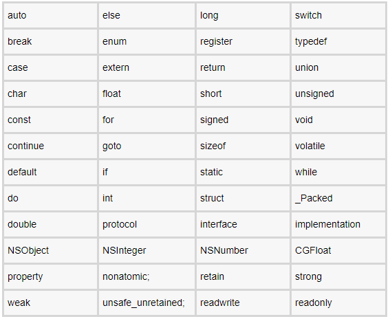
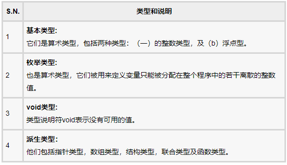
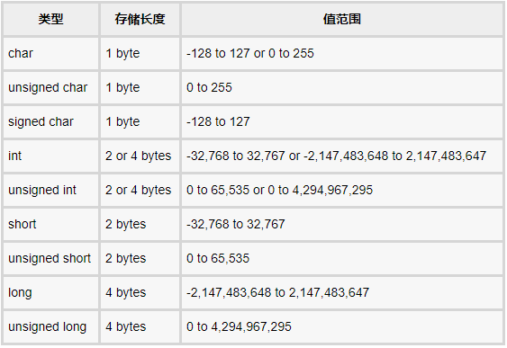
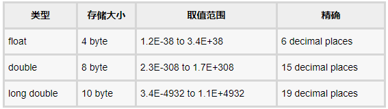
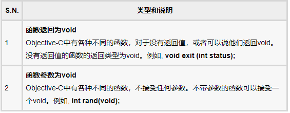

### Object-C基础

#### 概述：

完全支持面向对象编程：

- 封装
- 数据隐藏
- 继承
- 多态性

##### 基础框架

Foundation框架提供了大量的功能集

- 包括NSArray，NSDictionary中的NSSet等扩展数据类型的列表
- 由一组丰富的操作文件的函数，字符串，等等
- URL处理它提供的功能，如日期格式，数据处理，错误处理等实用工具

##### 程序组成

一个Objective-C语言程序基本上由以下几部分组成：

- 预处理命令
- 接口
- 实现
- 方法
- 变量
- 语句和表达式
- 注释

```Objective-C
#import <Foundation/Foundation.h> //预处理命令，告诉编译器包含Foundation.h文件

@interface SampleClass:NSObject //创建一个接口，继承NSObject(所有对象的基类)

    -(void)sampleMethod;

@end //接口结束

@implementation SampleClass //实现接口

    -(void)sampleMethod{
        NSLog(@"Hello, World!"); //打印日志消息
    }

@end //实现结束

int main() //主函数
{
   /* my first program in Objective-C */
   SampleClass *sampleClass = [[SampleClass alloc]init]; //创建对象
   [sampleClass sampleMethod]; //调用方法
   return 0; //函数返回
}
```

#### 基本语法

- Objective-C令牌

令牌是一个关键字，一个标识符，常量，字符串文字或符号。

- 分号

语句终止

- 注释

```Objective-C
/* my first program in Objective-C */
// my first program in Objective-C
```

- 标识符

用来标识变量、函数或其他用户定义的项目名称。由字母数字下划线组成，且不能以数字开头。Objective-C是区分大小写的语言。

- 关键字



#### 基本数据类型

Objective-C语言中的类型可分类如下：


**整型**
下表给出了有关标准的整数类型的存储大小和值范围：


为了得到确切的大小，类型或变量在特定平台上，可以使用sizeof运算符。表达式sizeof（类型）产生的对象或类型以字节为单位的存储大小。

```Objective-C
#import <Foundation/Foundation.h>

int main()
{
   NSLog(@"Storage size for int : %d", sizeof(int));
   return 0;
}
```

当编译并执行上述程序，在Linux上产生以下结果：

```
Storage size for int : 4
```

**浮点型**

下表给出了有关标准的存储大小和取值范围和精度的浮点类型的详细信息：


**void类型**



#### 函数与指针

#### 类&对象

Objective-C的特点：

- 类定义在两个不同的部分，即 @interface 和 @implementation.
- 几乎所有东西都以对象的形式。
- 对象接收消息和对象通常被称为接收器。
- 对象包含实例变量。
- 对象和实例变量的范围。
- 类隐藏对象的实现。
- 属性是用来提供访问其他类的类的实例变量。

类定义：
Objective-C中所有的类都派生自基类NSObject。它是所有的Objective-C类的超类。它提供了基本的方法，如内存分配和初始化。
实例变量是私有的，只能访问内部类实现。

```Objective-C
@interface Box:NSObject
{
    //Instance variables
    double length;   // Length of a box
    double breadth;  // Breadth of a box
}
@property(nonatomic, readwrite) double height; // Property

@end
```

对象分配和初始化：

```Objective-C
Box box1 = [[Box alloc]init];     // Create box1 object of type Box
Box box2 = [[Box alloc]init];     // Create box2 object of type Box
```

访问数据成员：
一个类的对象的属性可以直接使用成员访问运算符（.）访问。

```Objective-C
#import <Foundation/Foundation.h>

@interface Box:NSObject
{
    double length;   // Length of a box
    double breadth;  // Breadth of a box
    double height;   // Height of a box
}
@property(nonatomic, readwrite) double height; // Property

    -(double) volume;

@end

@implementation Box

@synthesize height;

    -(id)init
    {
    self = [super init];
    length = 1.0;
    breadth = 1.0;
    return self;
    }

    -(double) volume
    {
    return length*breadth*height;
    }

@end

int main( )
{
    NSAutoreleasePool * pool = [[NSAutoreleasePool alloc] init];
    Box *box1 = [[Box alloc]init];    // Create box1 object of type Box
    Box *box2 = [[Box alloc]init];    // Create box2 object of type Box

    // Store the volume of a box here
    double volume = 0.0;

    // box 1 specification
    box1.height = 5.0;

    // box 2 specification
    box2.height = 10.0;

    // volume of box 1
    volume = [box1 volume];
    NSLog(@"Volume of Box1 : %f", volume);

    // volume of box 2
    volume = [box2 volume];
    NSLog(@"Volume of Box2 : %f", volume);
    [pool drain];
    return 0;
}
```

运行结果：

```
Volume of Box1 : 5.000000
Volume of Box2 : 10.000000
```