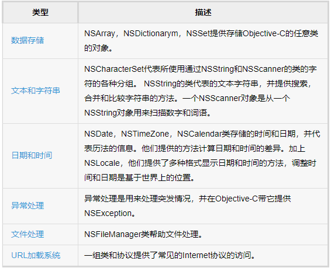

### Foundation 基础框架

Foundation 框架定义了一个基本层的Objective-C类。此外提供了一套有用的原始对象类，它介绍了几种范式定义未涵盖的Objective-C语言的功能。 Foundation框架的设计考虑到这些目标：

- 提供一小部分基本实用工具类。
- 使软件开发更容易通过引入一致约定的东西，如重新分配。
- 支持Unicode字符串，对象持久化和对象分布。
- 提供独立于OS的层，以提高便携性。

基于功能的基础类

#### 数据存储

数据存储和检索是在任何程序中的最重要的。在Objective-C中，我们一般不会依赖于像链表结构，因为它使复杂的工作。相反，我们使用的NSArray，NSDictionary，NSSet及其可变形式等的集合。

- NSArray & NSMutableArray

NSArray是用来装不可变的对象数组，NSMutableArray用于容纳一个可变数组对象。

Mutablility有助于改变数组中运行一个预分配的数组，但如果我们使用NSArray 只能更换现有数组，并不能改变现有数组的内容。

NSArray的主要方法：

- alloc/initWithObjects： 初始化数组对象。
- objectAtIndex： 获取特定索引位置的对象。
- count： 返回的对象数量。

NSMutableArray继承自NSArray，拥有NSArray所有实例方法。
主要方法如下：

- removeAllObjects： 清空数组。
- add

- NSDictionary & NSMutableDictionary

- NSSet & NSMutableSet

#### 文本和字符串

#### 日期和时间

#### 异常处理

#### 文件处理

#### URL加载系统