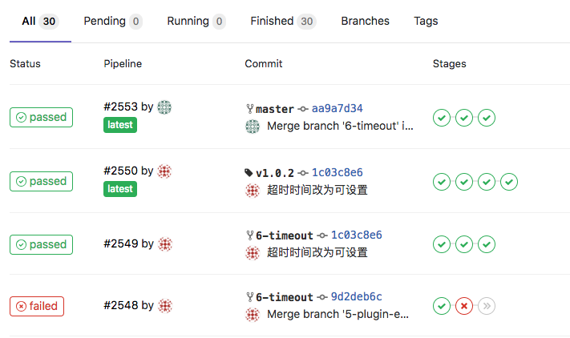
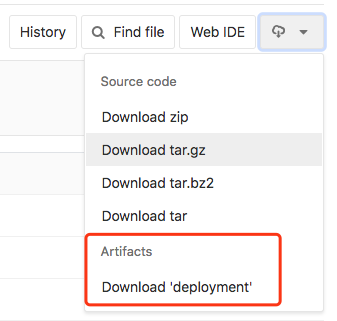

#### 一、runner安装与注册
1. 安装runner
[gitlab-runner安装](https://docs.gitlab.com/runner/install/index.html)

2. 注册runner
[gitlab-runner注册](https://docs.gitlab.com/runner/register/index.html)

#### 二、Android配置CI
为了使开发过程更加规范，提高工程代码的正确性，我们考虑使用gitlab持续集成系统对工程进行管理。首先需要将发布分支设置为保护分支，开发人员不能直接提交到保护分支，必须通过单元测试、代码审核等一系列流程。主要通过.gitlab-ci.yml文件和build.gradle来实现。每当开发人员push代码到gitlab上时，系统都会自动执行下面的流程：
    1）对代码进行静态分析
    2）运行工程中所有的单元测试
    3）显示单元测试的覆盖率报告
    4）部署，设置只在打tag的时候进行打包并生成对应文件，可通过网站直接下载

先看下接入CI流程的运行效果图，绿色表示流程通过，红色表示不通过：


首先，在工程根目录添加`.gitlab-ci.yml`文件，文件内容包含四个步骤。示例代码如下：
```yml
variables:
  ANDROID_COMPILE_SDK: "25"
  ANDROID_BUILD_TOOLS: "26.0.0"
  ANDROID_SDK_TOOLS: "24.4.1"

stages:
  - lint
  - test
  - print
  - deploy

staticAnalysis:
  stage: lint
  script:
    - ./gradlew lint -w

unitTests:
  stage: test
  script:
   - ./gradlew connectedAndroidTest -w
  dependencies:
   - staticAnalysis
  artifacts:
    paths:
     - app/build/reports/

printCoverage:
  stage: print
  script:
  - ./gradlew printCoverage -w
  dependencies:
  - unitTests

deployment:
  only:
    - tags  # 只有在打tag时才会执行
  stage: deploy
  script:
#    - ./gradlew myZip
    - zip -q -r -o "unikey-android-sdk-${CI_COMMIT_REF_NAME}.zip" "./unikey-android-sdk-publish" -x "*/\.*" -x "\.*"
  dependencies:
    - staticAnalysis
  artifacts:
    paths:
     - unikey-android-sdk-${CI_COMMIT_REF_NAME}.zip # 提供发包的zip文件下载
```

yml文件只是对流程进行控制，具体的操作依然需要gradle来实现。配置好yml文件后，再来配置build.gradle文件：
1. 静态分析
运行`./gradlew lint`命令即可对工程代码进行静态分析，当然可以对某些项设置不进行lint检查，添加如下配置即可：
```gradle
lintOptions {
    disable 'ButtonStyle', 'GradleDependency', 'IconDensities', 'IconDuplicates', 'IconMissingDensityFolder',
            'TooManyViews', 'TrustAllX509TrustManager', 'UnusedResources', 'UselessParent', 'OldTargetApi'
    abortOnError false
}
```

2. 单元测试
在测试工程中添加测试用例，关于Android工程如何添加单元测试暂且不记录，通过`./gradlew connectedAndroidTest`命令运行单元测试

3. 测试覆盖率
在build.gradle中打开测试覆盖率开关，代码如下：
```
buildTypes {
    debug {
        testCoverageEnabled true
    }
}
```
单元测试运行完毕后会在`app/build/reports/`目录下生成对应的测试覆盖率报告，gitlab提供了markdown代码读取覆盖率显示在readme里面，在setting->CI/CD下展开`General pipelines`项，`Pipeline status`和`Coverage report`下分别是读取当前工程CI是否通过和覆盖率报告的代码

4. 部署发包
在build.gradle中自定义task，将生成的aar或者apk文件复制到打包目录，如有需要可加入文档和demo，准备好打包文件即可进行zip压缩
```
task myZip(type: Zip, dependsOn: ['copy']) {
    doLast {
        // 复制example代码到打包目录
        copy {
            File inputJar = new File(projectDir.parentFile, "example")
            from(inputJar)
            File publishDesDir = new File(projectDir.parentFile, "android-sdk/example")
            into(publishDesDir)
            rename { String fileName ->
                fileName.replace(release_aar, justkey_aar)
            }
        }
        // 删除example的build目录
        File buildFile = new File(projectDir.parentFile, "android-sdk/example/build")
        delete buildFile
    }

    // 压缩打包
    from '../android-sdk'
    baseName = 'android-sdk-' + version
    File publishDesDir = new File(projectDir.parentFile, "app/build/android-sdk-zip")
    destinationDir = publishDesDir
}
```
yml文件中部署流程中的artifacts属性下的path的路径就是zip文件的路径，路径对应后就可以在gitlab网站直接下载生成的zip发包文件，效果如下：



**注意事项：**
1. 注册第五步需要选择true<br>
    ```
    Whether to run untagged jobs [true/false]:
    [false]: true
    ```

2. 如果运行`gitlab-runner start`后连不上，可以运行`gitlab-runner run`<br>
    [runner相关命令](https://docs.gitlab.com/runner/commands/README.html)<br>

3. 相同类型的工程可以考虑共用runner<br>
    步骤如下：
    1. 注册runner时，是否绑定runner在当前工程，选择false。如下：
    ```
    Whether to lock the Runner to current project [true/false]:
    [true]: false
    ```

    2. 使用root账号，进入需要共用runner的工程，进入Settings -> CI/CD -> Runners settings展开设置项, 点击`Enable for this project`按钮，即可将此runner运用于此工程。

#### 参考文档：
[runner注册文档](https://docs.gitlab.com/runner/register/index.html)