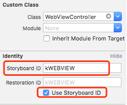

iOS界面跳转

方法一：

1.First ViewController（FVC）
在storyboard中设置SVC的ID，如图：


storyboard中已经有界面的情况下，跳转代码如下：
```Objective-C
// 通过在“Main.storyboard"中查找ID为 kWEBVIEW 的SVC
WebViewController* next = [[UIStoryboard storyboardWithName:@"Main" bundle:[NSBundle mainBundle]] instantiateViewControllerWithIdentifier:@"kWEBVIEW"];
[self presentViewController:next animated:YES completion:nil];
```

2.Second ViewController（SVC）
```Objective-C
// 返回FVC
[self dismissViewControllerAnimated:YES completion:nil];
```
